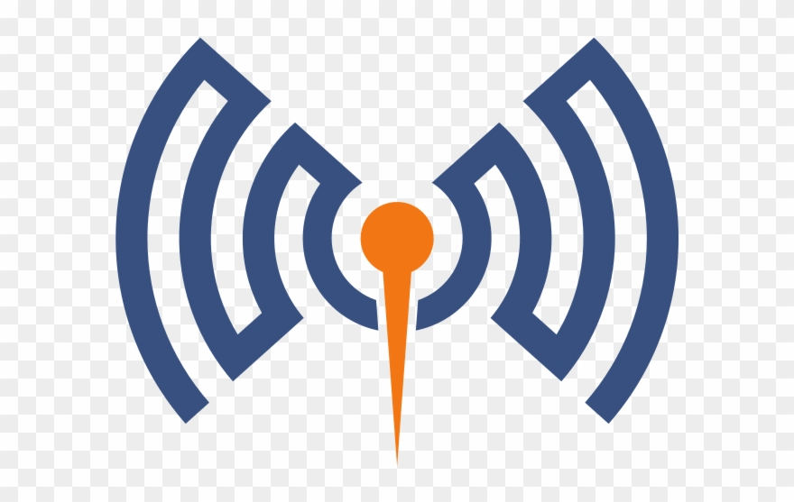
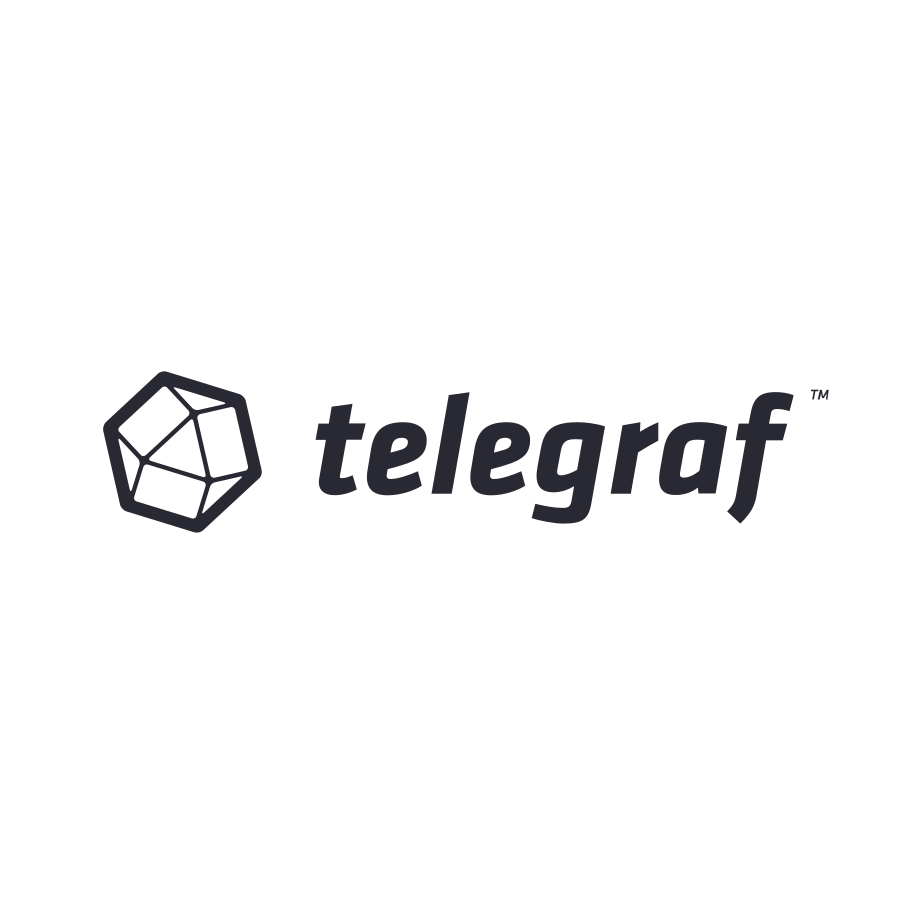

# Hi! 

Software developer, electrical engineer, PhD student, avid in IoT and home automation.

 

## &#x270d; Blog & Writing

Apart from coding, maintaining a blog/wiki/web log, you name it - [wiki.ayanev.eu](https://wiki.ayanev.eu/)

 

## 🔧 Technologies & Tools

 
 

<!-- Data structures
Logos to be added:
Algorithms
Design patterns

Express.js
Postman
IoT
Samba
Microservices
W3.css
W3.js
Prusa
3D printing
Fusion 360
Onfido
4Stop
PayPal
Stripe
CI/CD
UML
KendоUI
.NET
ASP NET Web API
VSTO
IIS
Code First
Database First
Stored procedure
-->

 
 
 
 

## &#x1F447; Get in touch

[][website]
[][linkedin]
[][thingiverse]
<!-- [][medium] -->

 
 

<!-- ## &#x1f4c8; ..and its nice to have some widgets -->

<!-- Profile views badge -->
<!--  -->

<!-- Table with Starts, Commits, Repositories, Followers, Issues, Pull requests -->
<!--  -->

<!-- Most Used Languages -->
<!--  -->

<!-- GitHub Profile Stats -->
<!--  -->
<!--  -->

<!-- Resources -->
<!-- Icons: https://simpleicons.org/ -->
<!-- GitHub Stats: https://github.com/anuraghazra/github-readme-stats -->
<!-- Emojis: https://emojipedia.org/emoji/ -->
<!-- HTML Emojis: https://www.fileformat.info/index.htm -->
<!-- Shields: https://shields.io/ -->
<!-- Awesome GitHub Profile README: https://github.com/abhisheknaiidu/awesome-github-profile-readme -->

[website]: https://ayanev.eu
[linkedin]: https://www.linkedin.com/in/ayanew
[medium]: https://medium.com/@atanas.yanew
[thingiverse]: https://www.thingiverse.com/ayanev
